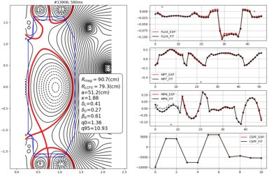
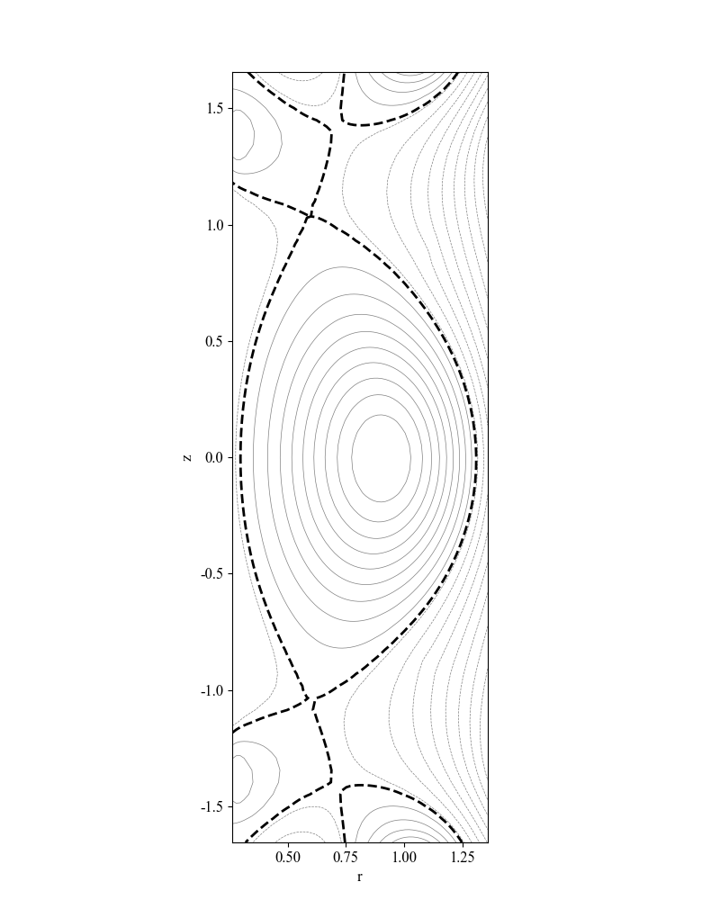

# 先进偏滤器位形（XPT）控制说明

## 1. 问题背景：为什么是 XPT

### 1.1 为什么先进偏滤器重要

聚变装置里，一个核心难点是 **等离子体-材料界面（PMI）** 与偏滤器靶板热负荷。标准单零偏滤器在高功率下容易出现过高峰值热流，而反应堆级运行又要求材料长期可承受。先进偏滤器位形（Advanced Divertor Configurations, ADCs）正是为缓解这一矛盾提出的。

XPT 属于 ADC 的一类。它依赖多个 **X 点** 组织分界面与磁力线拓扑，希望通过更强的几何和磁拓扑效应来：

- 增大磁通扩展，降低靶板峰值热流密度。
- 增加平行连接长度 \(L_{\parallel}\)，给辐射、复合、电荷交换等耗散过程更多空间。
- 为脱靶、热流展宽和更温和的偏滤器工况创造条件。

从第一性原理看，**我们并不是为了“追几个数字”而控制 X 点**，而是在控制一个会直接影响热流路径、功率耗散和边界条件的磁拓扑。

### 1.2 X 点在这里到底代表什么

X 点是极向磁场中的 **鞍点**。在理想情形下，它附近满足：

- 拓扑上：多条磁分界面在此组织和分离。
- 几何上：X 点数量与相对位置决定偏滤器构型是否仍是目标 XPT。
- 场论上：理想 X 点处极向场应接近 0。

因此，XPT 控制的核心不是单一标量调节，而是一个 **多目标耦合问题**：

- 既要维持整体形状和电流。
- 又要维持 X 点的位置与数量语义稳定。
- 还要让 X 点与 LCFS 对应的分界面条件尽量成立。

### 1.3 本仓库里的任务定义

在本仓库中，环境每一步返回 HFM 观测 `obs: dict`，策略输出 **12 维 PF 电压**。我们把任务理解为：

- 输入：当前等离子体形状、X 点、磁通网格、LCFS 采样、磁探针等观测。
- 输出：PF 电压控制量。
- 目标：在时间演化中维持或逼近目标 XPT 位形。

更具体地说，当前任务至少包含三层目标：

1. **全局形状目标**：`Ip`, `Rmin`, `Rmax`, `kappa` 等关键量不要漂移。
2. **局部拓扑目标**：X 点位置 `(rX, zX)` 应靠近目标配置。
3. **分界面/物理一致性目标**：X 点磁通 `FX` 应接近边界参考 `FB`，理想 X 点处极向场应接近 0。

---

## 2. 典型case炮
shot选择："13906_500"
**上图：装置实验 XPT（示例）**

**下图：HFM 中 13906 炮初态（本控制初始参考）**

上图：装置上实验得到的 XPT 类位形示例。下图：**HFM 环境复现的 13906 炮初始磁通面**；当前 RL 实验以该初态为起点，**首要目标是在控制过程中维持该 XPT 位形（拓扑与关键几何）稳定**，再在此之上细化标量跟踪与 X 点误差。

## 3. 环境观测中与 XPT 相关的字段

一步仿真结束后，观测为 `dict`，详见 `docs/reference.md`。与 XPT 最相关的字段如下。

### 3.1 电流与整体形状

| 字段 | 形状 | 简要含义 | 作用 |
| --- | --- | --- | --- |
| `Ip` | `(1,)` | 等离子体电流 | 全局约束与形状跟踪 |
| `Rmin`, `Rmax`, `kappa` | `(1,)` | 边界几何参数量 | 当前 baseline 的主要形状目标 |

### 3.2 磁通、网格与 LCFS

| 字段 | 形状 | 简要含义 | 作用 |
| --- | --- | --- | --- |
| `FB` | `(1,)` | lcfs边界参考极向磁通 | X 点和等磁通约束的参考量 |
| `Fx` | `(4290,)` | 极向磁通网格展平，`4290 = 66 × 65` | 用于重构二维 ψ 场 |
| `rx` | `(66,)` | 网格 R 坐标 | ψ 场插值与求导 |
| `zx` | `(65,)` | 网格 Z 坐标 | ψ 场插值与求导 |
| `rB`, `zB` | `(32,)` | LCFS 采样点 | 边界等磁通/几何分析 |

### 3.3 X 点

| 字段 | 形状 | 简要含义 | 作用 |
| --- | --- | --- | --- |
| `rX` | `(6,)` | X 点 R 坐标 | 拓扑与目标位置误差 |
| `zX` | `(6,)` | X 点 Z 坐标 | 同上 |
| `FX` | `(6,)` | 各 X 点处极向磁通 | 与 `FB` 比较，衡量分界面代理误差 |
| `nX` | `(1,)` | 当前有效 X 点个数 | 决定前几个槽位有效 |

注意：`rX`, `zX`, `FX` 只有前 `nX` 个有效。

### 3.4 磁探针

| 字段 | 形状 | 简要含义 | 作用 |
| --- | --- | --- | --- |
| `Bm` | `(100,)` | 磁探针信号 | 更贴近实验观测，可直接喂给策略 |

### 3.5 动作

本环境对外动作是 **12 维 PF 电压**，与 `HFMSimulator` 保持一致。

---

## 4. 为什么当前要用“固定 X 点槽位”

一个直接难点是：不同时间步的 `nX` 可能变化，X 点顺序也可能变化。如果直接把原始 `rX/zX/FX` 喂给网络，会导致同一维度在相邻时间步语义漂移，学习会很不稳定。

因此本仓库采用一下规则：

- 固定槽位数，默认 `slots=4`。
- 对有效 X 点按 `zX` **从高到低排序**。
- 再依次填入 4 个槽位，不足部分补 0，并给出 `valid` 掩码。

对应函数：`xpt_utils.extract_sorted_xpoints(obs, slots=4)`。

而是让策略和 reward 都基于 **稳定语义的槽位表示**：

- X 点始终按z方向从上往下顺序排列
- 缺失 X 点时，`valid=0`，上层逻辑可以显式惩罚或忽略。

当前磁通代理量定义为：

$$
|FX - FB|
$$

它表示 X 点磁通相对边界参考磁通的偏差。若 X 点确实落在期望分界面附近，该量应更接近 0。

---

## 5. 物理约束：从 `Fx` 到 ψ、再到 `Br/Bz`

### 5.1 `Fx` 不是最终特征，而是二维 ψ 场的展平

`Fx` 本质上是二维极向磁通场 ψ 的展平版本。为了做插值、等磁通残差或极向场分析，需要先把它还原为 `(66, 65)` 的网格。

本库提供：

- `reshape_fx_to_psi(Fx, order='C'|'F')`
- `infer_fx_reshape_order(obs)`
- `get_psi_grid(obs, order=None)`

其中一个实际细节是：HFM 数据可能沿用 MATLAB 列主序，而 numpy 默认是行主序。所以不能想当然把 `Fx.reshape(66, 65)` 当真。`infer_fx_reshape_order(obs)` 会比较 X 点处的 `FX` 与网格插值结果，自动在 `'C'` / `'F'` 中选更合理的还原方式。

### 5.2 极向场为什么重要

在 `(R, Z)` 截面上，极向磁通 ψ 与极向场分量满足：

$$
B_R = -\frac{1}{R}\frac{\partial \psi}{\partial Z}, \quad
B_Z = \frac{1}{R}\frac{\partial \psi}{\partial R}
$$

这给了我们一个比“位置误差”更接近物理本身的约束。

直觉上：

- 若只是 `(R,Z)` 接近目标，但局部场拓扑已经变形，单纯位置误差可能不够。
- 若 X 点附近确实还是理想鞍点，那么极向场模应接近 0。

本库的做法是：

1. 用 `numpy.gradient(psi, rx, zx)` 求 \(\partial\psi/\partial R\) 与 \(\partial\psi/\partial Z\)。
2. 对目标点做双线性插值。
3. 代入上式计算 `Br`, `Bz`。

对应函数：

- `gradient_psi_on_grid`
- `br_bz_at_point`
- `xpoint_poloidal_field_magnitude`

理想 X 点可用下式刻画：

$$
\sqrt{B_R^2 + B_Z^2} \approx 0
$$

数值上，因为公式含 `1/R`，实现里对 `R` 使用了下限 `r_floor`，避免除零。

---

## 6. 本仓库当前建议的两条控制路线

### 6.1 方案一：低维、可解释、适合作为 baseline

目标很明确：

1. 跟踪 4 个全局形状量：`Ip`, `Rmin`, `Rmax`, `kappa`。
2. 跟踪最多 4 个 X 点槽位的位置误差。
3. 约束各槽位的 `|FX - FB|`。

对应特征向量为 **20 维**：

`[Ip,Rmin,Rmax,kappa 相对误差] + 4 × [valid, dr, dz, dFX]`

其中：

- `dr`, `dz` 是 X 点位置相对目标的相对误差。
- `dFX = |FX - FB| / scale`。

函数：

`xpt_utils.scheme1_feature_vector(obs, target_keys=..., target_values=..., target_rX=..., target_zX=..., slots=4)`

适用场景：

- 快速建立可解释 baseline。
- 想先验证 reward 设计和 X 点排序逻辑是否有效。

### 6.2 方案二：加入更强的物理结构约束

方案二不只关心“点有没有对上”，还关心“磁面和局部场是否对”。

它包含两部分。

#### 6.2.1 12 点等磁通残差

- 在 LCFS 上取 8 个点：`rB[i], zB[i]`，默认 `i = 0, 4, 8, ..., 28`。
- 再加上 4 个排序后的 X 点槽位。
- 共 12 个点，定义残差：

$$
\psi(R_i, Z_i) - FB
$$

如果这些点确实都落在同一目标分界面上，那么残差应趋于 0。

函数：

`isoflux_residuals_scheme2(obs, lcfs_step=4, order=None)`

返回：

- 长度 12 的残差向量。
- `meta` 调试信息，包括索引、点位、`fb` 和 `fx_order`。

#### 6.2.2 X 点极向场模

函数：

`xpoint_poloidal_field_magnitude(obs, slots=4, order=None)`

返回每个槽位的：

- `Br`
- `Bz`
- `sqrt(Br^2 + Bz^2)`

适用方式：

- 直接作为 reward penalty。
- 作为 constraint 或 curriculum 中后期项。
- 作为日志诊断量，判断“位置对了但拓扑没对”的情况。

---

## 8. API 速查

| 函数 | 作用 |
| --- | --- |
| `extract_sorted_xpoints` | 按 `z` 降序固定槽位，返回 `r,z,FX,valid,nx,fb` |
| `flux_abs_diff` | 计算 `|FX-FB|/scale` |
| `relative_error` | 逐元素相对误差 |
| `lcfs_isoflux_indices` | 生成 LCFS 等间隔采样索引 |
| `reshape_fx_to_psi` / `infer_fx_reshape_order` / `get_psi_grid` | ψ 网格还原与主序推断 |
| `interp_psi_bilinear` | ψ 双线性插值 |
| `gradient_psi_on_grid` | 计算 `∂ψ/∂R`, `∂ψ/∂Z` |
| `poloidal_br_bz` | 由 `∂ψ` 与 `R` 计算 `Br,Bz` |
| `br_bz_at_point` | 任意 `(R,Z)` 处的 `Br,Bz` |
| `scheme1_feature_vector` | 20 维方案一特征 |
| `isoflux_residuals_scheme2` | 12 维等磁通残差 |
| `xpoint_poloidal_field_magnitude` | X 点 `Br,Bz` 与 `|B_pol|` |

---

## 9. 示例脚本

以下示例都需要 **已启动的 HFM 服务**，并通过 `HFMSimulator` 从真实环境拉取观测，不使用合成数据。

- `examples/example_xpt_scheme1.py`：打印方案一 20 维特征。
- `examples/example_xpt_isoflux.py`：打印方案二 12 点等磁通残差与 X 点极向场模。
- `examples/example_xpt_reward.py`：给出基于 `isoflux_residuals_scheme2` 的本地 `reward_fn` 示例。

共用逻辑见 `examples/xpt_example_common.py`。

