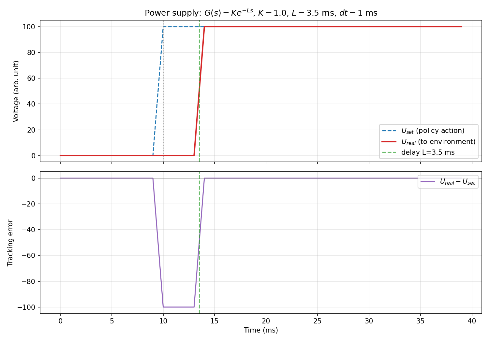

# 电源模型

本环境加入了一个轻量的电源响应模型，用来描述控制策略给出的电压指令与装置实际获得电压之间的差异。

在真实装置中，电源不会总是“立刻、完全、无误差”地输出控制器给定的电压。静态增益、偏置、通信延迟、控制延迟和执行链路动态都会让下面两者之间存在一定 gap：

```text
U_set   : 控制器给出的电压指令
U_real  : 电源实际输出到线圈的电压
```

当前实现位于 `environment.power_supply.PowerSupplyModel`。`HFMSocketPredictor.step()` 会先把 12 维动作经过电源模型，再发送给 HFM predictor。

## 当前行为

- 模型按 12 路线圈电压通道分别处理。
- 每个通道包含静态增益 `K` 和偏置 `b`。
- 每个通道包含一个小的响应延迟，默认在 `reset()` 时重新采样。
- 仿真步长按 `1 ms` 处理。
- `reset()` 会清空延迟缓存，使每个 episode 从干净的电源状态开始。

可以把链路理解为：

```text
策略动作 U_set
  -> 电源响应模型
  -> 实际电压 U_real
  -> HFM predictor
```

因此，策略不应假设给出的电压指令会在同一步被装置完全获得。这个特性让环境更接近真实装置中的执行链路。

## 示例

可以运行下面的示例查看简单阶跃响应：

```bash
python examples/example_power_supply_step.py
```

生成的响应图：



## 给选手的说明

电源模型是评估环境中一定存在的环境动态，不是可选开关，也不是官方评分公式。选手仍然输出 12 维电压指令，但实际进入 HFM predictor 的电压会经过电源响应模型处理。

评估时电源延时会带有随机性，因此本地结果不应假设某个固定延时完全可复现。选手可以在本地基于 `PowerSupplyModel` 自行模拟不同延时下的策略表现，用于提高策略对执行链路 gap 的鲁棒性。
