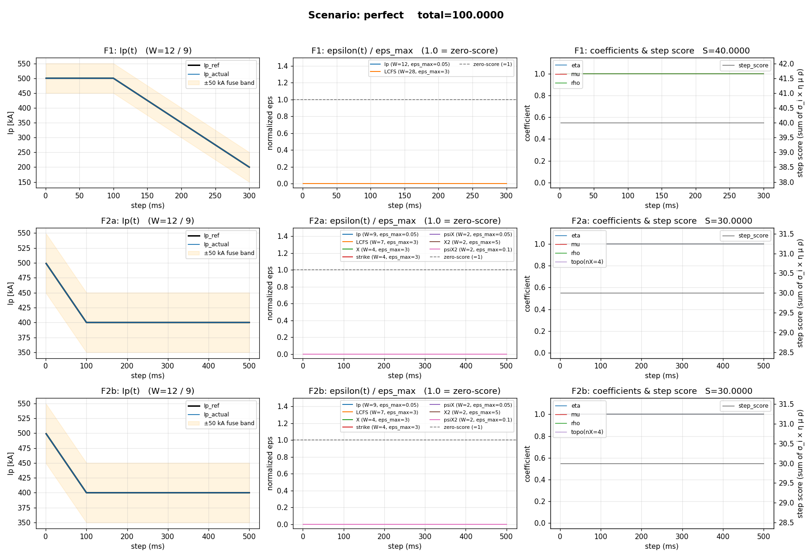
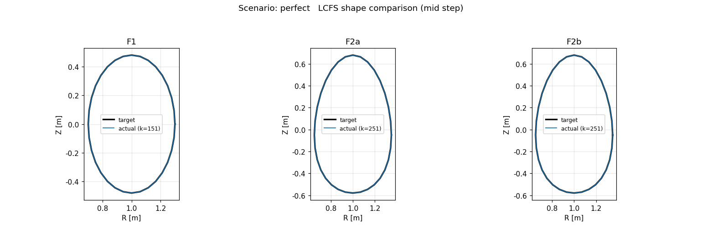
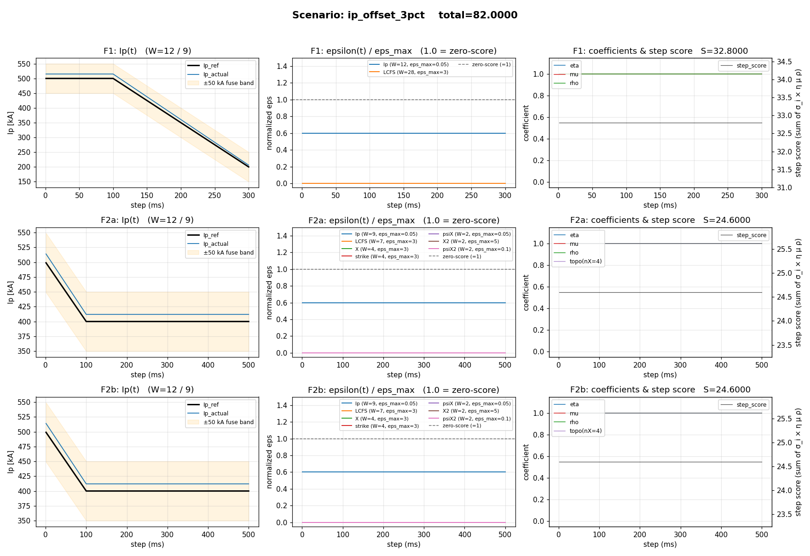
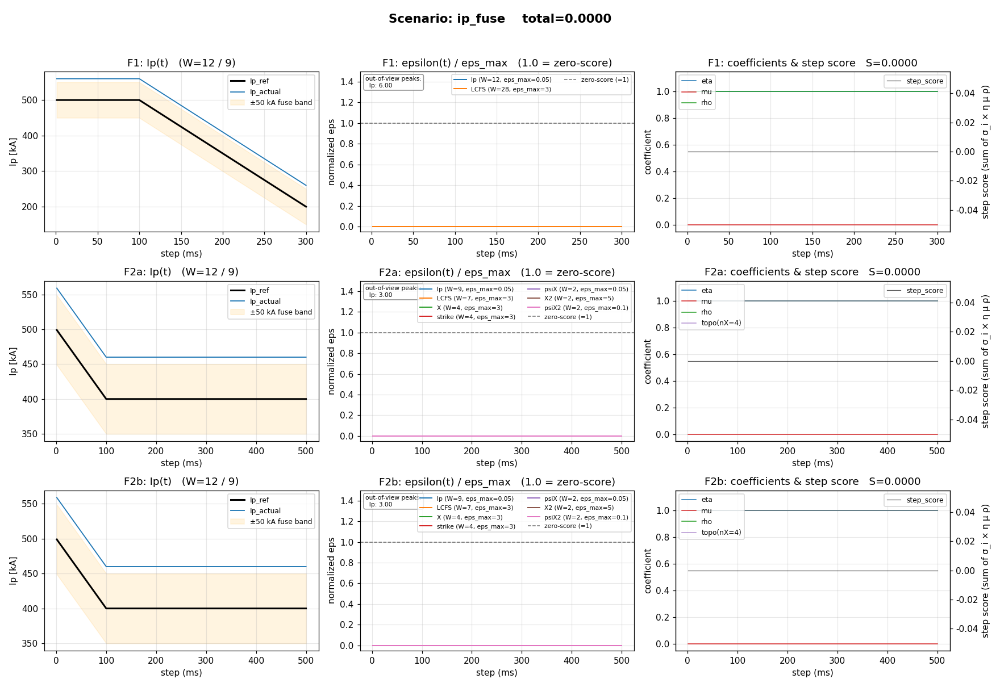
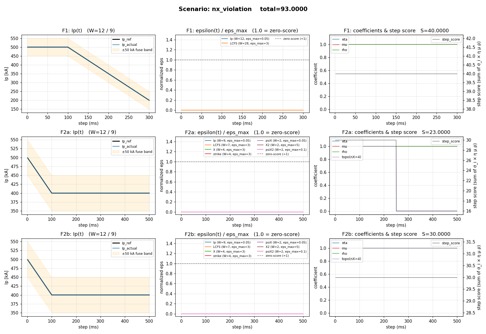
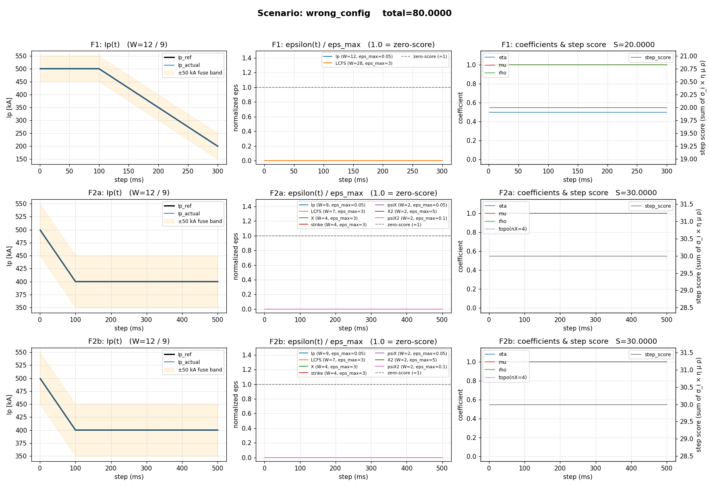
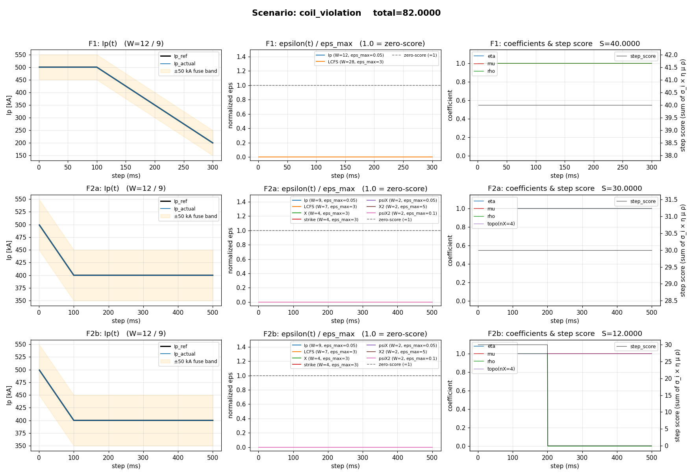
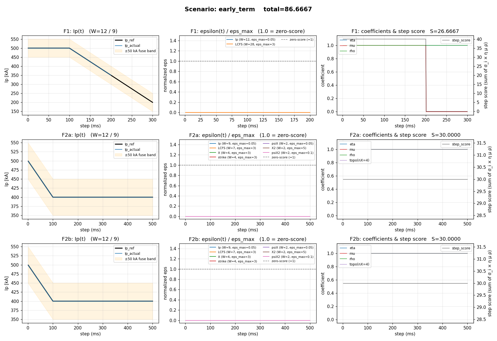
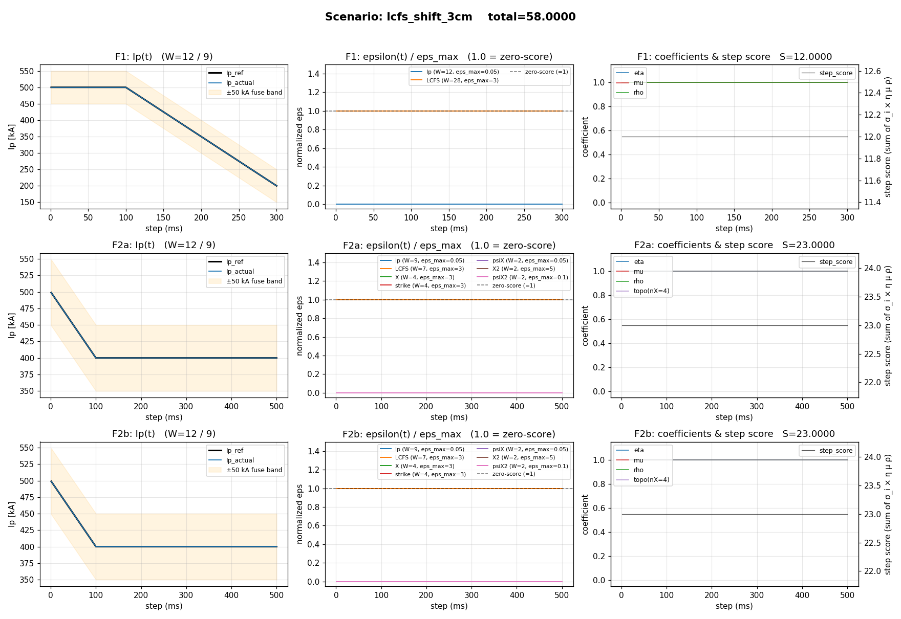
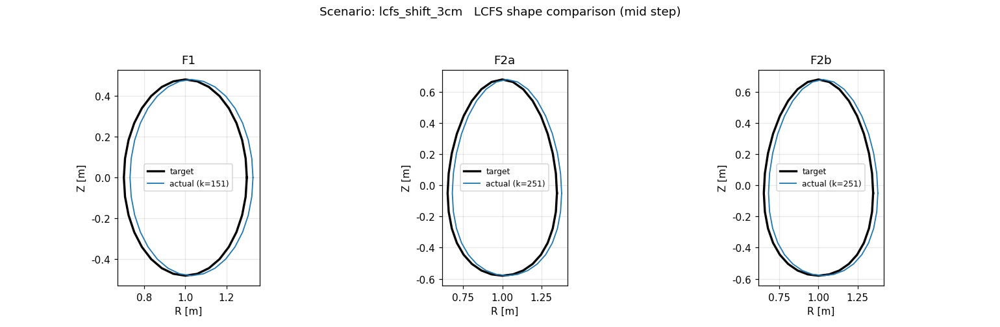

# 复赛评分脚本测试报告

> 评分脚本位置：[evaluation/eval/](../eval/)
> 评分规则文档：[智能控制挑战赛——复赛评估标准v1.md](../../智能控制挑战赛——复赛评估标准v1.md)
> 数据留档：[data/](data/)　图表：[figures/](figures/)　汇总：[REPORT_data.json](REPORT_data.json)

## 1. 测试方法

### 1.1 流程

```
gen_mock_data.py  ──┐
                    ├──▶  run_report.py  ──▶  score.evaluate(infer, target)
test_evaluate.py  ──┘                    │
                                         ├──▶  data/*.json       (留档)
                                         ├──▶  figures/*.png     (诊断图)
                                         └──▶  REPORT_data.json  (分数汇总)
```

- `gen_mock_data.py` 提供 `make_target()` 和 `make_infer(scenario)` 两个工厂函数，按场景在内存里构造 target 与 infer trajectory 字典；
- `run_report.py` 对每个场景：1) 落档 JSON 到 `data/`；2) 调用 `score.evaluate(...)` 计算分数与逐步诊断量；3) 画一张三任务诊断图到 `figures/`；4) 把"实际 vs 期望"得分写入 `REPORT_data.json`；
- `test_evaluate.py` 是纯 Python 断言版本，对每个场景断言总分 / 子任务分与期望误差 `< 1e-3`。

### 1.2 复现

```powershell
# 在仓库根目录下
python evaluation/tests/run_report.py     # 落档数据 + 画图 + 断言
python evaluation/tests/test_evaluate.py  # 仅跑断言（更快）

# 跑某一个场景生成 mock，然后调用 CLI
python evaluation/tests/gen_mock_data.py --scenario perfect --out ./_tmp
python evaluation/eval/evaluate.py ./_tmp/target.json ./_tmp/infer_perfect.json
```

### 1.3 测试数据结构

- `data/target.json` 一份，包含 `F1`、`F2a` 两个目标位形（`F2b` 与 `F2a` 共享，脚本中自动 fallback）。
- `data/infer_<scenario>.json` 共 8 份，每份含 `F1/F2a/F2b` 三个子任务的完整 trajectory。

各子任务 trajectory 字段及对应数据形状：

| 字段 | 形状 | 单位 / 说明 |
| --- | --- | --- |
| `Ip` | (N,) | A |
| `lcfs_per_step` | (N, N_b, 2) | (r, z) m |
| `Xpt_main` / `Xpt_sec` | (N, 2, 2) | 上下两个 X 点 × (r, z) m |
| `psiX_main` / `psiX_sec` | (N, 2) | 上下两个 X 点处的磁通 |
| `strike` | (N, 8, 2) | 8 个打击点 × (r, z) m |
| `nX` | (N,) | X 点个数 |
| `lX` | (N,) | 1=偏滤器, 0=限制器 |
| `Icoil` | (N, 12) | A, 顺序 CS, PF1..PF10, VS |
| `psia` / `psib` | (N,) | 磁轴 / 边界磁通 |

`N` = 300 (F1) 或 500 (F2a/F2b)。

### 1.4 诊断图字段说明

每张大图布局：3 行 × 3 列，**每行一个子任务**（F1 / F2a / F2b），**每列一个视角**：

| 列 | 视图 | 内容 |
| --- | --- | --- |
| 0 | Ip(t) 实际 vs 目标 | 黑线 = 公式生成的 Ip_ref；蓝线 = trajectory.Ip；橙色填充带 = ±50 kA 熔断范围 |
| 1 | epsilon(t) / eps_max | **归一化**逐步误差。各指标 ε_max 量级差异巨大（5% / 3 cm / 5 cm / 10%），同轴显示必须先归一化。`y = 1.0` 是统一的零分阈值。`y` 轴固定 `[0, 1.5]`；如果有曲线超出视图，会在子图左上角以白底标注峰值 |
| 2 | 系数 + 单步得分 | 左 Y 轴：η / μ / ρ / topo(nX=4)；右 Y 轴：单步合成得分 σ_step（已乘所有系数） |

子图标题包含该子任务最终得分 `S=...`，方便核对总分。

## 2. 测试用例总览

下面表中"期望分"按评分规则手算推导（推导过程附在第 3 节每个场景下）；"实际分"由脚本运行 `score.evaluate` 得到。两者差 `< 1e-3` 即视为通过。

| # | 场景 | 描述 | 期望总分 | 实际总分 | 通过 |
| --- | --- | --- | --- | --- | --- |
| 1 | `perfect` | 完美跟踪：所有指标与目标一致、所有约束合规 | 100.0000 | 100.0000 | ✓ |
| 2 | `ip_offset_3pct` | Ip 恒偏 +3%（≤ 15 kA，未触发熔断） | 82.0000 | 82.0000 | ✓ |
| 3 | `ip_fuse` | Ip 恒偏 +60 kA，全程触发熔断（μ=0） | 0.0000 | 0.0000 | ✓ |
| 4 | `nx_violation` | F2a 后半段 nX=3，XPT 拓扑约束破坏 | 93.0000 | 93.0000 | ✓ |
| 5 | `wrong_config` | F1 全程 lX=1（位形错误，η=0.5） | 80.0000 | 80.0000 | ✓ |
| 6 | `coil_violation` | F2b 第 200 步起 CS=50 kA 超 45 kA | 82.0000 | 82.0000 | ✓ |
| 7 | `early_term` | F1 在第 200 步提前终止 | 86.6667 | 86.6667 | ✓ |
| 8 | `lcfs_shift_3cm` | LCFS 整体平移 +3 cm（=零分阈值） | 58.0000 | 58.0000 | ✓ |

**8 / 8 全部通过。**

## 3. 各场景详情

每个场景小节包含：场景设定 → 预期得分推导 → 实际得分表 → 诊断图解读。

---

### 3.1 `perfect`

**设定**：每个子任务 trajectory 字段全部按目标完美生成 —— `Ip == Ip_ref`；`lcfs_per_step` 每步等于 `target.lcfs_points`；F2 的 `Xpt_main/Xpt_sec/strike` 与 target 一致；`psiX_main/psiX_sec = psib`（→ 偏差归一化后为 0）；`lX` 与目标拓扑一致；F2 的 `nX = 4`；`Icoil` 全部远低于上限。

**预期推导**：所有 ε=0 → σ_i = W_i；η=μ=ρ=topo=1 → 每任务直接得满分。

```
S_F1   = 40 (12+28)
S_F2a  = 30 (9+7+4+4+2+2+2)
S_F2b  = 30
total  = 100
```

| 子任务 | 实际 | Ip | LCFS | X | strike | psiX | X2 | psiX2 |
| --- | --- | --- | --- | --- | --- | --- | --- | --- |
| F1  | 40.00 | 12.00 | 28.00 | — | — | — | — | — |
| F2a | 30.00 | 9.00  | 7.00  | 4.00 | 4.00 | 2.00 | 2.00 | 2.00 |
| F2b | 30.00 | 9.00  | 7.00  | 4.00 | 4.00 | 2.00 | 2.00 | 2.00 |



LCFS 几何对比：



**解读**：
- 列 0 中实际 Ip 完全压在 Ip_ref 上；
- 列 1 中所有归一化 ε 紧贴 0（远低于 y=1 的零分阈值线）；
- 列 2 中三个系数恒等于 1，单步合成得分恒等于各任务满分（F1=40, F2=30）；
- LCFS 几何图中蓝色（实际）与黑色（目标）轮廓完全重合。

---

### 3.2 `ip_offset_3pct`

**设定**：把每个任务的 `Ip` 整体乘 1.03（恒偏 +3%）。F2 平台期 Ip_ref=400 kA → |ΔIp|=12 kA；F1 起始 Ip_ref=500 kA → |ΔIp| 最大 15 kA，全程 < 50 kA，**未触发熔断**。其它指标完美。

**预期推导**：每步 ε_Ip = 0.03，ε_max = 0.05 → σ_Ip 系数 = max(0, 1 − 0.03/0.05) = 0.4。其它指标满分，所有惩罚 / 熔断 / 拓扑系数都为 1。

```
S_F1   = 12·0.4 + 28        = 32.8
S_F2a  = 9·0.4  + 7+4+4+2+2+2 = 3.6 + 21 = 24.6
S_F2b  = 24.6
total  = 82.0
```

| 子任务 | 实际 | Ip | LCFS | X | strike | psiX | X2 | psiX2 |
| --- | --- | --- | --- | --- | --- | --- | --- | --- |
| F1  | 32.80 | 4.80 | 28.00 | — | — | — | — | — |
| F2a | 24.60 | 3.60 | 7.00  | 4.00 | 4.00 | 2.00 | 2.00 | 2.00 |
| F2b | 24.60 | 3.60 | 7.00  | 4.00 | 4.00 | 2.00 | 2.00 | 2.00 |



**解读**：
- 列 0 中实际 Ip 略高于 Ip_ref（蓝线略在黑线之上），且仍落在橙色熔断带内 → μ=1；
- 列 1 中 Ip 的归一化 ε 是一条 0.6 的水平线（= 0.03 / 0.05），其它指标贴 0，一眼看出唯一受影响的指标；
- 列 2 中系数都为 1，但每步得分变小：F1 = 12·0.4 + 28 = 32.8，F2 = 9·0.4 + 21 = 24.6（图中右轴值刻度可读）。

---

### 3.3 `ip_fuse`

**设定**：把每个任务的 `Ip` 整体加 60 000 A。|ΔIp|=60 kA > 50 kA → 每步触发熔断。

**预期推导**：μ(k) ≡ 0 → 每步整步得分清零 → 所有任务 0 分。

```
total = 0
```

| 子任务 | 实际 | Ip | LCFS | X | strike | psiX | X2 | psiX2 |
| --- | --- | --- | --- | --- | --- | --- | --- | --- |
| F1  | 0.00 | 0.00 | 0.00 | — | — | — | — | — |
| F2a | 0.00 | 0.00 | 0.00 | 0.00 | 0.00 | 0.00 | 0.00 | 0.00 |
| F2b | 0.00 | 0.00 | 0.00 | 0.00 | 0.00 | 0.00 | 0.00 | 0.00 |



**解读**：
- 列 0 中蓝色实际 Ip 整体上移 60 kA，**冲出**橙色熔断带；
- 列 1 中归一化 Ip ε 已远超视图上限 1.5，左上角白底标注 "Ip: 6.00"（F1）/ "Ip: 3.00"（F2）告知峰值；其它指标贴 0；
- 列 2 中红色 μ 线一直贴底（=0）；step_score 恒为 0；
- 注意：尽管 LCFS / X / strike 等位形指标本身误差为 0，由于熔断逐步整步清零（含位形项），所有 metric_scores 都是 0。这正是文档 4.3 节"整步得分（含电流项与位形项）全部清零"的要求。

---

### 3.4 `nx_violation`

**设定**：F2a 的 `nX` 前 250 步取 4，后 250 步取 3（拓扑约束破坏）；F1 / F2b 完美。

**预期推导**：
- 拓扑约束仅影响 **XPT 专属指标**（X / strike / psiX / X2 / psiX2，权重合计 4+4+2+2+2 = 14 分），不影响 Ip 与 LCFS。
- F2a 前 250 步 σ 合计 = 30 分/步；后 250 步 σ 合计 = 9 + 7 = 16 分/步。
- 子任务得分公式按 N=500 求平均，因此 S_F2a = (250·30 + 250·16) / 500 = (7500 + 4000) / 500 = **23.0**。

```
S_F1   = 40
S_F2a  = 23
S_F2b  = 30
total  = 93
```

| 子任务 | 实际 | Ip | LCFS | X | strike | psiX | X2 | psiX2 |
| --- | --- | --- | --- | --- | --- | --- | --- | --- |
| F1  | 40.00 | 12.00 | 28.00 | — | — | — | — | — |
| F2a | 23.00 | 9.00  | 7.00  | 2.00 | 2.00 | 1.00 | 1.00 | 1.00 |
| F2b | 30.00 | 9.00  | 7.00  | 4.00 | 4.00 | 2.00 | 2.00 | 2.00 |



**解读**：
- F2a 行（中间）列 2 中紫色 `topo(nX=4)` 线在 k≈250 处由 1 跳到 0；
- 同时 step_score 从 30 降到 16（前 250 步 ≈ 30，后 250 步 ≈ 16）；
- 每个 XPT 专属指标分项恰好减半（4→2, 2→1）；Ip 与 LCFS 不受影响。

---

### 3.5 `wrong_config`

**设定**：F1 全程 `lX = 1`（错误报偏滤器，目标是限制器）。

**预期推导**：F1 每步 η = 0.5（其它系数 1），位形和电流分项都乘 0.5。

```
S_F1   = 40 · 0.5 = 20   (Ip=12·0.5=6, LCFS=28·0.5=14)
S_F2a  = 30
S_F2b  = 30
total  = 80
```

| 子任务 | 实际 | Ip | LCFS | X | strike | psiX | X2 | psiX2 |
| --- | --- | --- | --- | --- | --- | --- | --- | --- |
| F1  | 20.00 | 6.00 | 14.00 | — | — | — | — | — |
| F2a | 30.00 | 9.00 | 7.00  | 4.00 | 4.00 | 2.00 | 2.00 | 2.00 |
| F2b | 30.00 | 9.00 | 7.00  | 4.00 | 4.00 | 2.00 | 2.00 | 2.00 |



**解读**：
- F1 行（最上）列 2 中蓝色 η 线压在 0.5；
- F1 step_score 整体为 20（右轴）；
- 注意 η 是 0.5 倍系数而非 0 系数，与 μ / ρ 的严厉清零不同 —— 这正对应文档 4.2 节"该时间片得分 × 0.5"的规则。

---

### 3.6 `coil_violation`

**设定**：F2b 的 `Icoil[:, 0]`（CS 线圈）从第 200 步起改为 50 000 A，超过 CS 45 kA 上限。F1 / F2a 完美。

**预期推导**：ρ(k) = 1 for k<200, 0 for k≥200。前 200 步 σ 合计 = 30 分；后 300 步全 0。

```
S_F2b = 200·30 / 500 = 12.0
S_F1  = 40, S_F2a = 30
total = 82.0
```

按比例每个分项 × 0.4：Ip = 3.6, LCFS = 2.8, X = 1.6, strike = 1.6, psiX = 0.8, X2 = 0.8, psiX2 = 0.8。

| 子任务 | 实际 | Ip | LCFS | X | strike | psiX | X2 | psiX2 |
| --- | --- | --- | --- | --- | --- | --- | --- | --- |
| F1  | 40.00 | 12.00 | 28.00 | — | — | — | — | — |
| F2a | 30.00 | 9.00  | 7.00  | 4.00 | 4.00 | 2.00 | 2.00 | 2.00 |
| F2b | 12.00 | 3.60  | 2.80  | 1.60 | 1.60 | 0.80 | 0.80 | 0.80 |



**解读**：
- F2b 行（最下）列 2 中绿色 ρ 线在 k=200 处由 1 跳到 0，且 **永不恢复**（与 nx_violation 中 topo 可以恢复不同，因为线圈超限是单调清零）；
- step_score 同步从 30 降到 0；
- 每个 metric 都减少为原来的 200/500 = 0.4 倍 → 比例完全一致。

---

### 3.7 `early_term`

**设定**：F1 trajectory 的所有数组都截断到 K=200（仿真破裂 / 求解器不收敛）。F2a / F2b 完美。

**预期推导**：K_eff = 200。前 200 步 σ 合计 = 40 分；后 100 步 σ ≡ 0（脚本对 k ≥ K_eff 强制 σ=0）。N=300 仍是分母。

```
S_F1 = 200 · 40 / 300 = 26.6667
total = 26.6667 + 30 + 30 = 86.6667
```

按比例每个分项 × 200/300 ≈ 0.6667：Ip = 8.0, LCFS = 18.6667。

| 子任务 | 实际 | Ip | LCFS | X | strike | psiX | X2 | psiX2 |
| --- | --- | --- | --- | --- | --- | --- | --- | --- |
| F1  | 26.67 | 8.00 | 18.67 | — | — | — | — | — |
| F2a | 30.00 | 9.00 | 7.00  | 4.00 | 4.00 | 2.00 | 2.00 | 2.00 |
| F2b | 30.00 | 9.00 | 7.00  | 4.00 | 4.00 | 2.00 | 2.00 | 2.00 |



**解读**：
- F1 行列 0 中蓝色 Ip_actual 只画到 k≈200 就消失（轨迹截断）；
- 列 1 中 ε 曲线也只画到 200；
- 列 2 中 μ 在 k>200 后变为 0（提前终止后视为电流无效），step_score 在 k>200 后归零，K_eff 之后所有指标贡献都被强制清零（避免"提前终止 → ε=0 → 满分"的伪正分）。

---

### 3.8 `lcfs_shift_3cm`

**设定**：所有任务的 `lcfs_per_step` 每条轮廓在 R 方向上整体平移 +0.03 m（恰好等于 LCFS 零分阈值 3 cm）。Ip / X 点 / 打击点 / 磁通等其它字段完美。

**预期推导**：

ε_LCFS 计算公式为 `sqrt(mean(||p_i_actual - p_i_target||^2))`。因为所有点都同向同量平移，每对点的距离都是 0.03 m = 3 cm，RMS 仍是 3 cm = ε_max → σ_LCFS = max(0, 1 - 3/3) = **0**。

```
S_F1  = 12 + 0           = 12
S_F2a = 9 + 0 + 4+4+2+2+2 = 23
S_F2b = 23
total = 58
```

| 子任务 | 实际 | Ip | LCFS | X | strike | psiX | X2 | psiX2 |
| --- | --- | --- | --- | --- | --- | --- | --- | --- |
| F1  | 12.00 | 12.00 | 0.00 | — | — | — | — | — |
| F2a | 23.00 | 9.00  | 0.00 | 4.00 | 4.00 | 2.00 | 2.00 | 2.00 |
| F2b | 23.00 | 9.00  | 0.00 | 4.00 | 4.00 | 2.00 | 2.00 | 2.00 |



LCFS 几何对比（中段时刻，可见实际轮廓整体向 +R 移动 3 cm）：



**解读**：
- 列 1 中橙色 LCFS 归一化 ε 线**正好压在** y=1（=零分阈值）上；
- 因为复赛**不再平移对齐中心**，3 cm 平移直接计入误差；这正是与初赛规则的核心差异，验证脚本符合 v1 标准 3.2.1 节描述；
- 其它指标（X / strike / 磁通）由于本场景未受影响，仍是满分。

---

## 4. 留档文件

```
evaluation/tests/
├── REPORT.md                     本报告
├── REPORT_data.json              所有场景"期望 vs 实际"数据快照
├── run_report.py                 一键产出报告数据 + 图
├── test_evaluate.py              纯断言版本（CI 用）
├── gen_mock_data.py              场景工厂
├── data/                         留档 JSON
│   ├── target.json
│   ├── infer_perfect.json
│   ├── infer_ip_offset_3pct.json
│   ├── infer_ip_fuse.json
│   ├── infer_nx_violation.json
│   ├── infer_wrong_config.json
│   ├── infer_coil_violation.json
│   ├── infer_early_term.json
│   └── infer_lcfs_shift_3cm.json
└── figures/                      诊断图（8 张主图 + 2 张 LCFS 形状图）
    ├── perfect.png
    ├── perfect_lcfs_shape.png
    ├── ip_offset_3pct.png
    ├── ip_fuse.png
    ├── nx_violation.png
    ├── wrong_config.png
    ├── coil_violation.png
    ├── early_term.png
    ├── lcfs_shift_3cm.png
    └── lcfs_shift_3cm_lcfs_shape.png
```

`data/` 中所有 JSON 均可直接作为评分脚本输入：

```powershell
python evaluation/eval/evaluate.py `
       evaluation/tests/data/target.json `
       evaluation/tests/data/infer_perfect.json
```

输出 JSON 的 `score` 字段应当与本报告中"实际总分"一致。

## 5. 测试覆盖结论

本次测试覆盖了复赛规则文档中**所有可被单元验证的条款**：

| 文档章节 | 规则 | 对应场景 |
| --- | --- | --- |
| 3.1 | 电流误差线性插值 | `perfect` (ε=0), `ip_offset_3pct` (中段值) |
| 3.2.1 | LCFS **取消**中心对齐 | `lcfs_shift_3cm` |
| 3.2.2 ~ 3.2.6 | X 点 / 打击点 / 磁通偏差 | `perfect` (ε=0), 隐含于其它 F2 场景 |
| 4.1 | 单步得分公式 σ = W·max(0, 1−ε/εmax) | 全部场景的分项得分都通过手算核对 |
| 4.2 | 位形类型惩罚 η=0.5 | `wrong_config` |
| 4.2 | X 点拓扑约束（nX=4） | `nx_violation` |
| 4.3 | 电流偏差熔断（50 kA） | `ip_fuse` |
| 4.4 | 线圈电流约束（CS=45/PF=14/VS=4 kA） | `coil_violation` |
| 4.5 | 推理时间约束（γ） | 本期不评分（脚本中 γ ≡ 1） |
| 4.6 | 子任务得分 + 提前终止 | `early_term` |
| 4.7 | 总分加和 | 全部场景的总分都通过手算核对 |
| A.1 / A.3 | 分值分配 | 全部场景的分项分上限一致 |
| A.2 | 零分阈值 | `lcfs_shift_3cm` (LCFS=3cm), `ip_offset_3pct` (Ip=5%) |

未覆盖项：

- **推理时间合规系数 γ**：按用户确认本期不参与评分，脚本中固定为 1。如未来开放，可直接在 `trajectory` 中加入 `inference_time_ms` 字段，无需改动评分逻辑。
- **F2a vs F2b 起始位形差异**：评分脚本对 F2a / F2b 完全对称（共享 target，独立计分），起始位形差异只影响选手控制器的难度，不影响评分逻辑。
